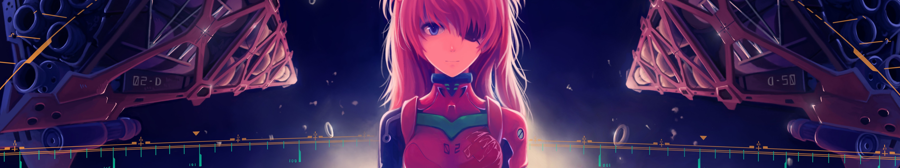

## 🏷️api-server


<h3>🏷️一个api工具集,多种丰富的api接口供你选择。</h3>


<h3>🏷️实现模块:  还在开发中......</h3>

- <h4>📌img-api &nbsp;&nbsp;&nbsp;&nbsp;🎨图片模块 ---  //以实现</h4> 
- <h4>📌music-api 🎧音乐模块 ---  //开发中</h4> 
- <h4>📌text-api &nbsp;&nbsp;&nbsp;&nbsp;📒文本模块 ---  //开发中</h4>
- <h4>📌tool-api &nbsp;&nbsp;&nbsp;&nbsp;🗃️工具模块 ---  //开发中</h4>
- <h4>📌task-api &nbsp;&nbsp;&nbsp;⏳任务模块 ---  //开发中</h4>


<h3>🏷️使用技术栈&工具</h3>

🛠️


<br><br>

---


# 部署

//TODO:


<br><br><br><br>

# Img-图片模块



<br>


## 本站收录图片数 ：

## 其中收录url图片：

## 其中收录file图片：


## Img-Api-Docs：


- 🏷️获取随机图片 - 重定向
- 🏷️获取随机图片 - 响应体
- 🏷️获取随机图片 - JSON数据
- 🏷️获取随机图片 - 响应体 - 服务器
- 🏷️获取给定诺干URL随机图片 - 重定向
- 🏷️获取给定诺干URL随机图片 - 响应体返回
- 🏷️获取数字图片-图片计数器
- 🏷️获取指定参数图标-Icons
- 🏷️获取GitHub访问量--初始化
- 🏷️获取GitHub访问量计数
- 🏷️更多实现中......


<br><br>

## API


### 获取随机图片 - 重定向

```
GET: /img/url
```

- 获取`url`库中数据随机一个图片，进行**重定向**。
- 请求参数：`不必要`
  - `bili=` 默认为1，可选：`bili=1`、`bili=2`、`bili=3`
  - 不加请求参数为默认 `1`
    - `bili=1` ：横图
    - `bili=2` ：竖图
    - `bili=3` ：似正方形

- 📌示例1：[https://api.ayaka.icu/img/url](https://api.ayaka.icu/img/url) 获取数据一张横图图片
- 📌示例2：[https://api.ayaka.icu/img/url?bili=2](https://api.ayaka.icu/img/url?bili=2) 获取数据一张横图图片

<br>

---

<br>


### 获取随机图片 - 响应体

```
GET: /img/url.io
```

- 获取`url`库中数据随机一个图片，进行**响应体返回**。
- 请求参数：`不必要`
  - `bili=` 默认为1，可选：`bili=1`、`bili=2`、`bili=3`
  - 不加请求参数为默认 `1`
    - `bili=1` ：横图
    - `bili=2` ：竖图
    - `bili=3` ：似正方形
- 📌示例1：[http://api.ayaka.icu/img/url.io](http://api.ayaka.icu/img/url.io) 获取数据一张横图图片
- 📌示例2：[http://api.ayaka.icu/img/url.io?bili=2](http://api.ayaka.icu/img/url.io?bili=2) 获取数据一张横图图片
- 注意：性能`GET: /img/url`差

<br>

---

<br>


### 获取随机图片 - JSON数据

```
GET: /img/url/json
```

- 获取`url`库中数据随机一个图片信息，**JSON返回**
- 请求参数：无
- 📌示例1：[http://api.ayaka.icu/img/url/json](http://api.ayaka.icu/img/url/json) 获取数据一张横图图片


<br>

---

<br>


### 获取随机图片 - 响应体 - 服务器

```
GET: /img/file.io
```

- 获取`file`库中数据随机一个图片，进行**响应体返回**。
- 请求参数：`不必要`
  - `bili=` 默认为1，可选：`bili=1`、`bili=2`、`bili=3`
  - 不加请求参数为默认 `1`
    - `bili=1` ：横图
    - `bili=2` ：竖图
    - `bili=3` ：似正方形
- 📌示例1：[https://api.ayaka.icu/img/file.io](https://api.ayaka.icu/img/file.io) 获取数据一张横图图片
- 📌示例2：[https://api.ayaka.icu/img/file.io?bili=2](https://api.ayaka.icu/img/file.io?bili=2) 获取数据一张横图图片
- 注意：性能`GET: /img/url.io` 好

<br>

---

<br>


###  获取给定诺干URL随机图片 - 重定向

```
GET: /img/tool/urls?urls=xxx@@xxx
```

- 获取给定诺干URL图片地址，随机其中一个进行**重定向返回**。
- 请求参数：`必要`
  - `urls=路径1@@路径2@@更多` 
  - 每个路径以`@@`相隔
- 📌示例1：[https://api.ayaka.icu//img/tool/urls?urls=http://img.ayaka.icu/i/2023/03/25/641e74f1770ad.jpg@@http://img.ayaka.icu/i/2023/03/25/641e80711778b.jpg](https://api.ayaka.icu/img/tool/urls?urls=http://img.ayaka.icu/i/2023/03/25/641e74f1770ad.jpg@@http://img.ayaka.icu/i/2023/03/25/641e80711778b.jpg) 
- 注意：
  - 同样适用于 **非图片** 链接 的随机重定向
  - 参数是必要的，且以`@@`相隔开，

<br>

---

<br>


### 获取给定诺干URL随机图片 - 响应体返回

```
GET: /img/tool/urls.io?urls=xxx@@xxx
```

- 获取给定诺干URL图片地址，随机其中一个进行**响应体返回**。
- 请求参数：`必要`
  - `urls=路径1@@路径2@@更多` 
  - 每个路径以`@@`相隔
- 📌示例1：[https://api.ayaka.icu//img/tool/urls.io?urls=http://img.ayaka.icu/i/2023/03/25/641e74f1770ad.jpg@@http://img.ayaka.icu/i/2023/03/25/641e80711778b.jpg](https://api.ayaka.icu/img/tool/urls.io?urls=http://img.ayaka.icu/i/2023/03/25/641e74f1770ad.jpg@@http://img.ayaka.icu/i/2023/03/25/641e80711778b.jpg) 
- 注意：
  - 非图片链接无法使用！
  - 性能`GET: /img/tool/urls?urls=xxx@@xxx` 差
  - **非必要请勿使用！**

<br> <hr> <br>


### 获取指定参数图标-Icons

```
GET: /icons?i=icon1,icon2,icon3
```

- 获取给定诺干个Icon名称，返回这些图标，**转发**。
- 请求参数：`i:必要`,`theme:非必要`,`size:非必要`
  - `i` ：给定的icon参数
    - 多个以英文`,`相隔开
    - 参数请查看：[https://github.com/tandpfun/skill-icons#icons-list](https://github.com/tandpfun/skill-icons#icons-list)
  - `theme` ：主题色
    - `1` 为黑暗色 默认
    - `2` 为明亮色
  - `size`：每行最多多少个图片，超过自动分行
    - 默认为`15`
  - 每个路径以**`@@`**相隔
- 📌示例1：[http://api.ayaka.icu/icons?i=java,idea,nginx,docker,redis,spring,mysql,github,linux,lua,md](http://api.ayaka.icu/icons?i=java,idea,nginx,docker,redis,spring,mysql,github,linux,lua,md) 
- 🪄效果1：
- 📌示例2：[http://api.ayaka.icu/icons?i=java,idea,nginx,docker,redis,spring,mysql,github,linux,lua,md&theme=2](http://api.ayaka.icu/icons?i=java,idea,nginx,docker,redis,spring,mysql,github,linux,lua,md&theme=2)
- 🪄效果2：
- 📌示例3：[http://api.ayaka.icu/icons?i=java,idea,nginx,docker,redis,spring,mysql,github,linux,lua&size=5](http://api.ayaka.icu/icons?i=java,idea,nginx,docker,redis,spring,mysql,github,linux,lua&size=5)
- 🪄效果3：
- 📌示例4：[http://api.ayaka.icu/icons?i=java,idea,nginx,docker,redis,spring,mysql,github,linux,lua&theme=2&size=5](http://api.ayaka.icu/icons?i=java,idea,nginx,docker,redis,spring,mysql,github,linux,lua&theme=2&size=5)
- 🪄效果4：
- 注意：
  - 这个API实际是重定向[https://skillicons.dev/](https://skillicons.dev/)的API !
  - 他们的GitHut: [https://github.com/tandpfun/skill-icons](https://github.com/tandpfun/skill-icons)
  - 你可以直接使用它们的Api，毕竟经过了2次请求！
  - 我只是做了转发重定向，整合到一起。
  - 再次感谢他们🥰[https://ko-fi.com/thijsdev](https://ko-fi.com/thijsdev)
  - 💖


<br>

---

<br>


### 获取数字图片-图片计数器

```
GET: /img/count?num=123
```

- 获取指定数字，返回数字图片计数。
- 请求参数：`num:必要` , `max:非必要`
  - `num` ：指定数字
    - 最高限制为`11`位数字
  - `max` ：返回格式
    - 默认为`6`
    - 未满足位数前面补零
    - `num > max` 时，跟随num大小：`max = num`
- 📌示例1：[http://api.ayaka.icu/img/count?num=789](http://api.ayaka.icu/img/count?num=789)
- 🪄效果1：
- 📌示例2：[http://api.ayaka.icu/img/count?num=123456&max=8](http://api.ayaka.icu/img/count?num=123456&max=8)
- 🪄效果2：
- 📌示例3：[http://api.ayaka.icu/img/count?num=87654321](http://api.ayaka.icu/img/count?num=87654321)
- 🪄效果3：
- 注意：
  - 最大位数为**11** 位


<br>

---

<br>


---


## 后台管理API


TODO: 以实现，文档改天写


**库表设计：**

从网络中获取url

```mysql
CREATE TABLE `tb_img` (
  `id` int(20) NOT NULL AUTO_INCREMENT COMMENT '唯一id',
  `url` varchar(128) NOT NULL UNIQUE COMMENT '图片路径',
  `size` double(5,3) NOT NULL COMMENT '图片大小: 单位MB 最大  double(5,2)',
  `name` varchar(32) NOT NULL COMMENT '图片名称',
  `type` varchar(4) NOT NULL COMMENT '图片类型 jpg/png/...',
  `scale` int(2) NOT NULL COMMENT '图片比例 1:横屏 2:竖屏 3:类似正方形',
  `width` int(5) NOT NULL COMMENT '图片宽度',
  `height` int(5) NOT NULL COMMENT '图片长度',
  `json` varchar(168) NULL COMMENT '图片JSON格式，key：url+size+width+height+type',
  `time` timestamp NULL DEFAULT NULL COMMENT '图片更新时间',
  PRIMARY KEY (`id`)
) ENGINE=InnoDB AUTO_INCREMENT=1000 DEFAULT CHARSET=utf8mb4 COLLATE=utf8mb4_unicode_ci;
```

从本机路径中获取url

```mysql
CREATE TABLE `tb_img_file` (
  `id` int(20) NOT NULL AUTO_INCREMENT COMMENT '唯一id',
  `path` varchar(128) NOT NULL UNIQUE COMMENT '图片文件路径',
  `size` double(5,3) NOT NULL COMMENT '图片大小: 单位MB 最大  double(5,2)',
  `name` varchar(32) NOT NULL COMMENT '图片名称',
  `type` varchar(4) NOT NULL COMMENT '图片类型 jpg/png/...',
  `scale` int(2) NOT NULL COMMENT '图片比例 1:横屏 2:竖屏 3:类似正方形',
  `width` int(5) NOT NULL COMMENT '图片宽度',
  `height` int(5) NOT NULL COMMENT '图片长度',
  `json` varchar(168) NULL COMMENT '图片JSON格式，key：url+size+width+height+type',
  `time` timestamp NULL DEFAULT NULL COMMENT '图片更新时间',
  PRIMARY KEY (`id`)
) ENGINE=InnoDB AUTO_INCREMENT=1000 DEFAULT CHARSET=utf8mb4 COLLATE=utf8mb4_unicode_ci;
```


TODO: 以后写


---


## 实现原理&设计


**库表设计：**

从网络中获取url

```mysql
CREATE TABLE `tb_img` (
  `id` int(20) NOT NULL AUTO_INCREMENT COMMENT '唯一id',
  `url` varchar(128) NOT NULL UNIQUE COMMENT '图片路径',
  `size` double(5,3) NOT NULL COMMENT '图片大小: 单位MB 最大  double(5,2)',
  `name` varchar(32) NOT NULL COMMENT '图片名称',
  `type` varchar(4) NOT NULL COMMENT '图片类型 jpg/png/...',
  `scale` int(2) NOT NULL COMMENT '图片比例 1:横屏 2:竖屏 3:类似正方形',
  `width` int(5) NOT NULL COMMENT '图片宽度',
  `height` int(5) NOT NULL COMMENT '图片长度',
  `json` varchar(168) NULL COMMENT '图片JSON格式，key：url+size+width+height+type',
  `time` timestamp NULL DEFAULT NULL COMMENT '图片更新时间',
  PRIMARY KEY (`id`)
) ENGINE=InnoDB AUTO_INCREMENT=1000 DEFAULT CHARSET=utf8mb4 COLLATE=utf8mb4_unicode_ci;
```

从本机路径中获取url

```mysql
CREATE TABLE `tb_img_file` (
  `id` int(20) NOT NULL AUTO_INCREMENT COMMENT '唯一id',
  `path` varchar(128) NOT NULL UNIQUE COMMENT '图片文件路径',
  `size` double(5,3) NOT NULL COMMENT '图片大小: 单位MB 最大  double(5,2)',
  `name` varchar(32) NOT NULL COMMENT '图片名称',
  `type` varchar(4) NOT NULL COMMENT '图片类型 jpg/png/...',
  `scale` int(2) NOT NULL COMMENT '图片比例 1:横屏 2:竖屏 3:类似正方形',
  `width` int(5) NOT NULL COMMENT '图片宽度',
  `height` int(5) NOT NULL COMMENT '图片长度',
  `json` varchar(168) NULL COMMENT '图片JSON格式，key：url+size+width+height+type',
  `time` timestamp NULL DEFAULT NULL COMMENT '图片更新时间',
  PRIMARY KEY (`id`)
) ENGINE=InnoDB AUTO_INCREMENT=1000 DEFAULT CHARSET=utf8mb4 COLLATE=utf8mb4_unicode_ci;
```


TODO: 以后写


